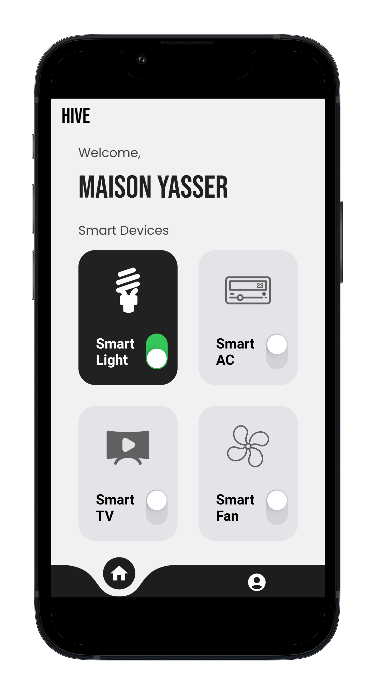
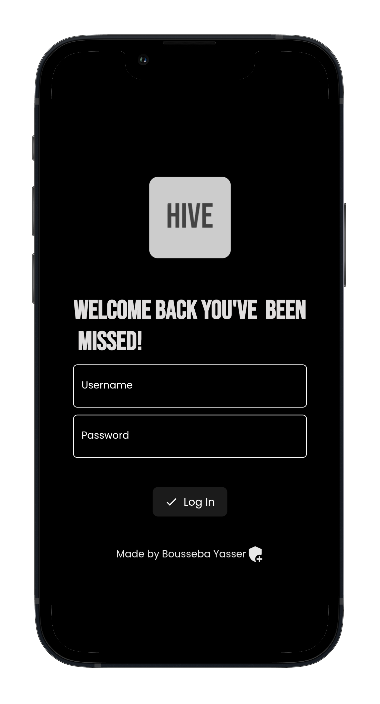
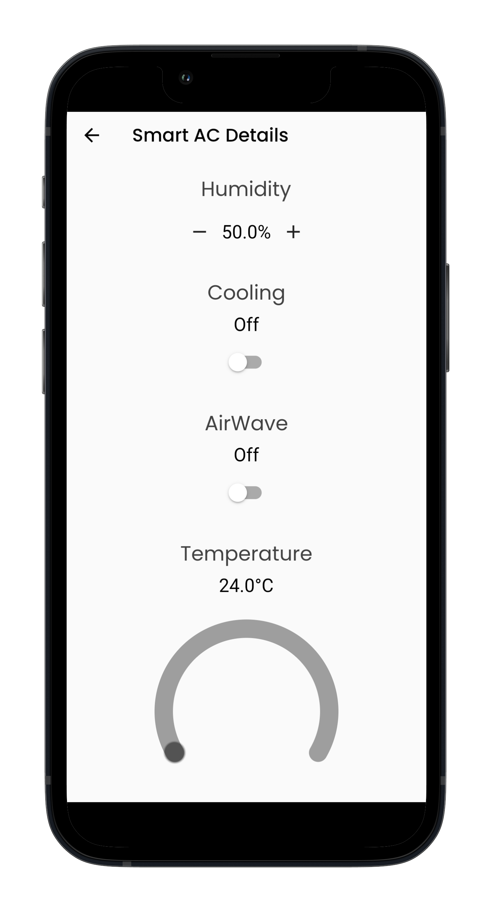
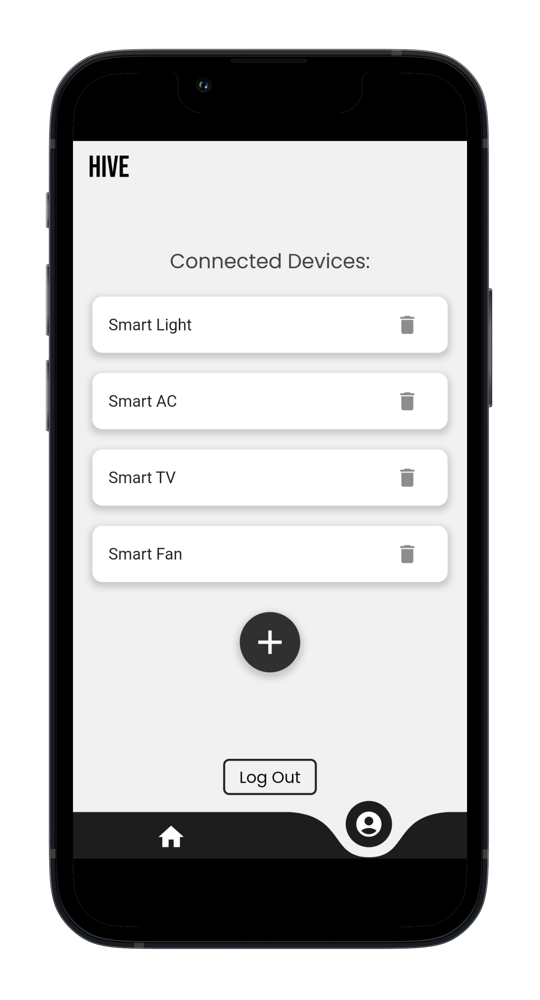
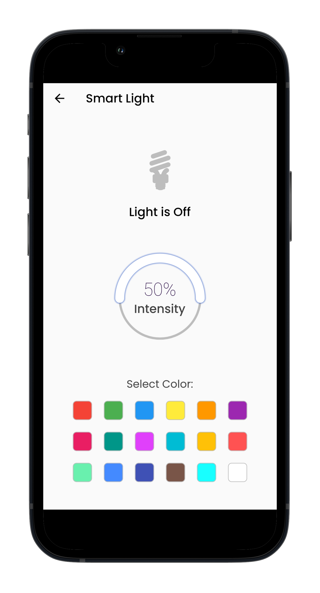
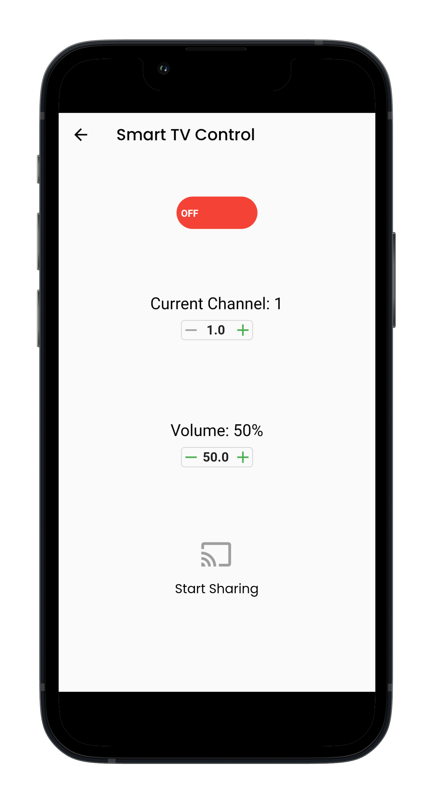
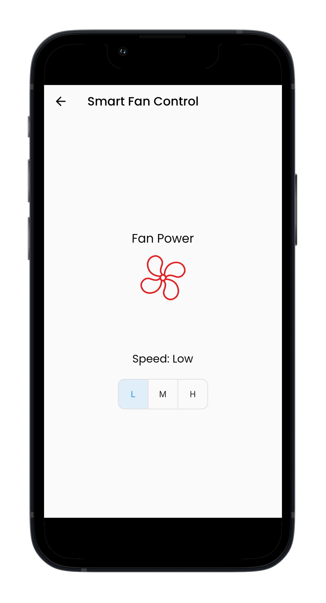

## About Flutter

Flutter is an open-source UI software development kit created by Google. It is used to develop cross platform applications for Android, iOS, Linux, macOS, Windows, Google Fuchsia, and the web from a single codebase.

<p float="left">
  
</p>

### Why Choose Flutter?

- **Fast Development**: Flutter’s hot reload helps you quickly and easily experiment, build UIs, add features, and fix bugs faster.
- **Expressive and Flexible UI**: Quickly ship features with a focus on native end-user experiences. Layered architecture allows for full customization, which results in incredibly fast rendering and expressive and flexible designs.
- **Native Performance**: Flutter’s widgets incorporate all critical platform differences such as scrolling, navigation, icons, and fonts to provide full native performance on both iOS and Android.

<br>

# Hive App

Welcome to Hive App! This app allows you to control and monitor your smart home devices with ease. 


## Features

- **Device Control**: Turn on/off lights, adjust thermostat settings, and control other smart devices.
- **Monitoring**: Real-time monitoring of home security cameras, door sensors, and other monitoring devices.
- **Automation**: Set up automation rules to make your home smarter.
- **User-friendly Interface**: Easy to navigate interface for all age groups.
- **Remote Access**: Control your home from anywhere in the world.

  <br>

## Installation

1. **Clone the Repository**
    ```sh
    git clone 
    cd 
    ```

2. **Install Dependencies**
    ```sh
    flutter pub get
    ```

3. **Run the App**
    ```sh
    flutter run
    ```

<br>

## Usage

1. **Sign Up / Login**: Create a new account or log in with your existing credentials.
2. **Add Devices**: Add your smart home devices using the app.
3. **Control and Monitor**: Use the app to control and monitor your devices.

<br>

## Screenshots

### Home Screen


### Sign Up / Login


### Monitoring
<div style="display: flex; flex-wrap: wrap;">
  
  
  
  
  
</div>
